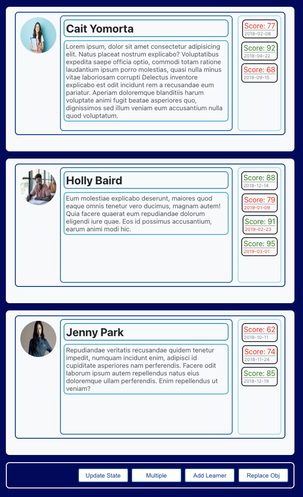

## ALAB 320H.3.1 - Rendering Arrays in React

## Learning Objecttives

- Create React components from arrays of data being stored in state.

## Under Construction 🚧

> - Need to fix the state buttons.
